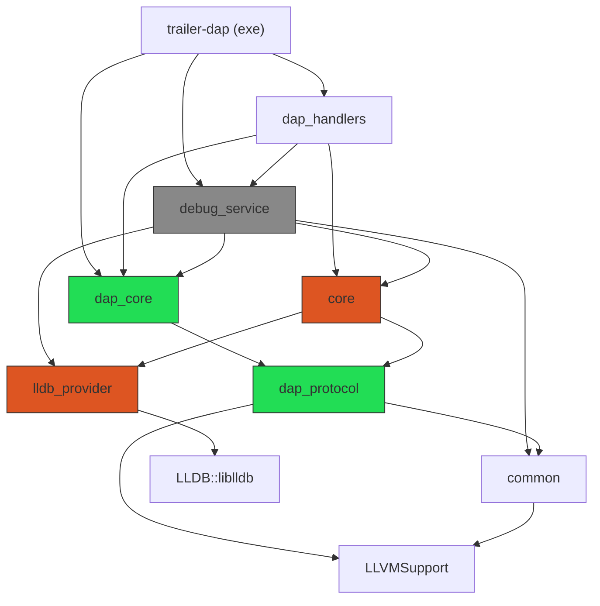

# Modules and layers

Link DAG extracted from CMake (`target_link_libraries`), verified against
source. A -> B means A links B.

Green = LLDB-free. Orange = owns/links LLDB directly. Gray = fork remnant,
scheduled for deletion (see `05-limitations.md` #6).

Acyclic, confirmed: `dap_protocol <- dap_core <- debug_service <-
dap_handlers`, `dap_protocol <- core <- dap_handlers`
(`modules/dap/CMakeLists.txt:12-13`, stated in the file's own header
comment).

## Target-to-directory map

| Target | Directory | Sources | LLDB? |
|---|---|---|---|
| `dap_protocol` | `modules/dap/` | `src/protocol/*.cc`, `src/protocol_support.cc`, `src/dap_error.cc`, `src/json_utils.cc` | No |
| `dap_core` | `modules/dap/` | `src/transport.cc`, `src/orchestrator.cc`, `src/dap_log.cc`, `src/response_handler.cc`, `src/progress_event.cc` | No |
| `debug_service` | `modules/dap/src/debug_service/` | `debug_service.cc`, `lldb_utils.cc` | Yes (fork remnant) |
| `dap_handlers` | `modules/dap/src/handlers/` | ~40 handler `.cc` files + `session.cc`, `register_handlers.cc`, `capabilities.cc`, `request_handler.cc` | Indirectly, and directly in ~15 handler bodies |
| `core` | `modules/core/` | `debug_context.cc`, `variable_description.cc`, `lldb_utils.cc`, `components/*.cc` | Yes |
| `lldb_provider` | `modules/providers/lldb_provider/` | header-only (`INTERFACE` library, no `.cc`) | Yes (owns `LLDB::liblldb`) |

Anchors: `modules/dap/CMakeLists.txt:34-43` (`dap_protocol`), `:68-74`
(`dap_core`), `:99-117` (`debug_service`), `:125-189` (`dap_handlers`);
`modules/core/CMakeLists.txt:12-40` (`core`);
`modules/providers/lldb_provider/CMakeLists.txt:3,17-19` (`lldb_provider`,
`add_library(lldb_provider INTERFACE)`).

## Real LLDB boundary vs stated boundary

`dap_protocol` and `dap_core` are genuinely LLDB-free - every `lldb::` grep
hit in those directories is a comment, not code (e.g.
`include/dap/protocol/dap_types.hpp:26,62` are prose references, not
`#include`s). This half of the stated boundary holds.

`dap_handlers` is documented as "the only thing allowed to know about a
specific service" (`modules/dap/CMakeLists.txt:119-124`), meaning it may
depend on `debug_service`/`core` at the *target* level. In practice this
license extends past dependency and into direct SB API use inside handler
bodies: ~15 handler `.cc` files construct and drive `lldb::SBThread`,
`SBFrame`, `SBValue`, `SBProcess` etc. directly, rather than only calling
into `core` methods. See `05-limitations.md` #1-2 for the handler-by-handler
breakdown.

## debug_service: not yet deleted

Target still defined and linked (`modules/dap/CMakeLists.txt:99-117`, linked
by `trailer-dap` at `engine/CMakeLists.txt:98` and by `dap_handlers` at
`modules/dap/CMakeLists.txt:187`). 21 handler files still
`#include "debug_service/..."` headers for leftover free-function helpers
(`variables.hpp`, `json_utils.hpp`, `lldb_utils.hpp`). The module's own
CMakeLists comment (`:86-90`) calls it "transitional... meant to be absorbed
into a future DebugContext/component layer rather than live on indefinitely."
Detail in `05-limitations.md` #6.

## Stale cross-reference

`modules/dap/CMakeLists.txt:178-180` claims `dap_main.cc` needs
`DebugServiceSession`, declared in a `dap/debug_service_factory.hpp`. Neither
symbol nor file exists in source (`grep` finds zero hits; only a stale
`clangd` index cache entry remains). The real seam is `dap::Session` /
`dap::CreateSession` in `dap/session.hpp` (`src/dap_main.cc:18,42`). The
comment predates a rename and was never updated.
