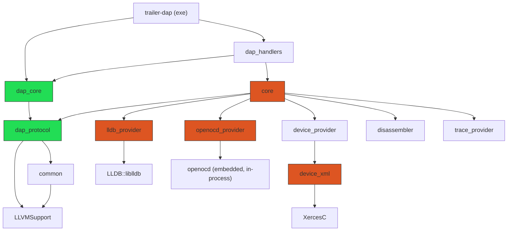

# Modules and layers

Link DAG extracted from CMake (`target_link_libraries`), verified against
source.

Green = LLDB/OpenOCD/Xerces-free. Orange = links one of those three directly.

Acyclic, as stated in `modules/dap/CMakeLists.txt`'s own header comment:
`dap_protocol <- dap_core <- dap_handlers`, `dap_protocol <- core <-
dap_handlers`. `core` depends on `dap_protocol` (pure wire-format value
types), never on `dap_core`'s behavioral machinery
(Transport/Orchestrator/dispatch) - the rationale is that sharing
`dap_protocol` avoids parallel domain DTOs for every component's result
shape, while keeping `core` usable without any particular communication
layer on top of it.

## Target-to-directory map

| Target | Directory | What it is |
|---|---|---|
| `dap_protocol` | `modules/dap/` | Wire-format value types + JSON conversion (`src/protocol/*.cc`, `protocol_support.cc`, `dap_error.cc`, `json_utils.cc`). LLDB-free: the `lldb::`-shaped ID typedefs the wire structs use are plain fixed-width types + local macros (`dap/protocol/dap_defines.hpp`); `Symbol.type` is `dap_protocol`'s own `SymbolType` enum, not `lldb::SymbolType` - `core`/providers convert at the boundary. |
| `dap_core` | `modules/dap/` | `Transport`, `Orchestrator`, generic request dispatch (`src/transport.cc`, `orchestrator.cc`, `dap_log.cc`, `response_handler.cc`, `progress_event.cc`). |
| `dap_handlers` | `modules/dap/src/handlers/` | ~48 concrete request handlers across 10 domain subdirectories (`breakpoints/`, `disassembly/`, `execution/`, `inspection/`, `lifecycle/`, `memory/`, `peripheral/`, `symbols/`, `trace/`, `watch/`), plus `session.cc` (the sole `EventBus` subscriber, translates `DomainEvent` to wire `Event`s), `register_handlers.cc`, `capabilities.cc`, `request_handler.{hpp,cc}`, `unknown_request_handler.cc`. |
| `core` | `modules/core/` | `DebugContext` + 10 domain components (`debug_context.cc`, `variable_description.cc`, `lldb_utils.cc`, `components/*.cc`). The only layer that names `lldb::`/OpenOCD/device-provider types below `dap_handlers`. |
| `lldb_provider` | `modules/providers/lldb_provider/` | Header-only (`INTERFACE` library). Owns `SBDebugger`/`SBTarget`, exposes `WithTarget(callable)` as the sole synchronized-access seam. |
| `openocd_provider` | `modules/providers/openocd_provider/` | Embeds OpenOCD as a library, in-process - no subprocess, no external `openocd` binary at `launch` time. Owns the TCL command dispatch thread, memory access, and trace-sink/source extraction. |
| `device_provider` | `modules/providers/device_provider/` | STM32 device/peripheral truth: CubeMX-derived memory maps (`device_index.cc`, `rzone_parser.cc`, `memory_map.cc`), executable-relative resource resolution (`resource_paths.cc`), a facade (`device_pack.cc`). Links `device_xml` (see below). |
| `device_xml` | `modules/providers/device_provider/xml/` | Isolated RTTI/exceptions island: CMSIS-SVD parsing via CodeSynthesis XSD-generated C++/Tree bindings, links Xerces-C. Exposes only `svd_model.hpp` (plain structs) - nothing downstream needs RTTI or Xerces because it links this target. |
| `disassembler` | `modules/providers/disassembler/` | LLVM-MC-based disassembly, independent of LLDB (per `CLAUDE.md`'s design goal). |
| `trace_provider` | `modules/providers/trace/trace_provider/` | Instruction-trace pipeline facade over `trace_decoder` (OpenCSD-based ETMv4 decode), `trace_sink`, `trace_model`, `trace_transform`. |

## RTTI/exceptions boundary

LLVM/LLDB are built `-fno-rtti`; `core` and everything under it compiles
`-fno-rtti` too (`core/CMakeLists.txt`), except two deliberately isolated
islands that need RTTI/exceptions and are walled off so it never leaks:

- `device_xml` (Xerces-C + the generated CMSIS-SVD tree) - `-frtti` is
  `PRIVATE` on this one target specifically, so it affects only its own
  translation units, not `device_provider` or anything above it.
- OpenCSD (linked by `trace_decoder`, pulled in via `trace_provider`) needs
  RTTI for the same reason - `lldb_provider` is never linked into a
  translation unit that also touches OpenCSD.

## What's gone

**`debug_service`** - the half-absorbed `lldb-dap` fork remnant this
document set used to spend most of its length on - has been deleted
entirely: no target, no directory, no `#include`. The domain logic it used
to hold lives in `core`'s components now. (A stale `clangd` index cache
still has entries for it; that's a cache artifact, not source.)

**The `trailer` trace-analysis CLI** - a second executable that used to
link `disassembler`/`trace_provider`/etc. independently of `trailer-dap` -
is gone too. The trace pipeline is now a `core` dependency
(`core -> trace_provider`), driven live through `TraceManager` and the
`trailerTrace*` DAP requests, not run offline against a captured snapshot
file.
