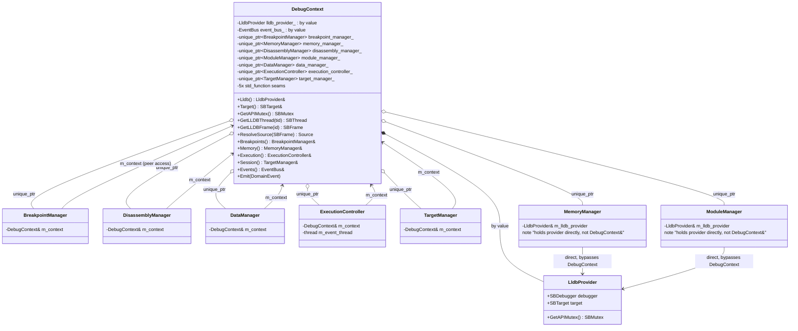

# Class relationships

## Domain side: DebugContext and its components



`DebugContext` is a mediator: 5 of 7 managers hold `DebugContext&` and reach
every peer only via `m_context.<Peer>()` (e.g.
`execution_controller.cc:440` `context.Breakpoints().GetExceptionBPFromStopReason(...)`).
`MemoryManager` and `ModuleManager` break this pattern - they hold
`providers::LldbProvider&` directly (`memory_manager.hpp:66,71`), wired at
construction (`debug_context.cc:24,26`: `std::make_unique<MemoryManager>(lldb_provider_)`
vs `std::make_unique<BreakpointManager>(*this)` for the rest). They can never
see a sibling manager even if a future feature needed them to. See
`05-limitations.md` #7.

Constructor order (`debug_context.cc:22-29`) fixes construction order but not
an explicit dependency graph among managers - all 7 are built in one
initializer list against `*this`/`lldb_provider_`, which are both
already-initialized members at that point (declaration order in the header
makes this safe, but nothing enforces it if the header's member order
changes).

## Communication side: handler base classes

```mermaid
classDiagram
    class IRequestHandler {
        <<interface>>
        +Run(Request) void
        +GetSupportedFeatures() FeatureSet
    }

    class Service {
        <<interface, dead>>
        +SupportedCommands() vector~string~
        +HandleRequest(Request) void
    }

    class BaseRequestHandler {
        -Orchestrator& orchestrator_
        -DebugContext& context_
        +Run(Request) void
        +operator()(Request)* void
    }

    class RequestHandler~Args,Resp~ {
        +operator()(Request) void
        #Run(Args)* Resp
        #PostRun() void
    }

    class DelayedResponseRequestHandler~Args,Resp~ {
        +operator()(Request) void
        #Run(Args)* Resp
    }

    IRequestHandler <|.. BaseRequestHandler
    BaseRequestHandler <|-- RequestHandler
    BaseRequestHandler <|-- DelayedResponseRequestHandler
    RequestHandler <|-- "~40 concrete handlers"
    DelayedResponseRequestHandler <|-- LaunchRequestHandler
    DelayedResponseRequestHandler <|-- AttachRequestHandler
```

`IRequestHandler` (`include/dap/request_handler.hpp:73`) is the LLDB-agnostic
seam the `Orchestrator` dispatches through by command name
(`orchestrator.cc:77-79`). `BaseRequestHandler`
(`src/handlers/request_handler.hpp:42`) holds exactly two references -
`Orchestrator&` for communication, `DebugContext&` for domain - and declares
`operator()` pure virtual. `RequestHandler<Args,Resp>` (`:108`) parses args,
calls virtual `Run(const Args&)`, formats the response; `Resp` is either
`llvm::Error` or `llvm::Expected<SomeResponseBody>`, branched at compile time
(`:120-131`). `DelayedResponseRequestHandler<Args,Resp>` (`:151`) is the same
shape but stashes the response via
`orchestrator_.SetDeferredConfigurationResponse` instead of sending
immediately - used only by `launch`/`attach`, flushed by
`ConfigurationDoneRequestHandler::PostRun`.

`Service` (`include/dap/service.hpp:17`) is a second, parallel dispatch
abstraction - a coarser-grained alternative to `IRequestHandler`, checked as
a fallback in `Orchestrator::HandleRequest` (`orchestrator.cc:82-89`,
`command_owners_` table). `Orchestrator::RegisterService` has zero call
sites in the tree (confirmed via language-server references search) - no
`Service` is ever registered in `trailer-dap`. Dead abstraction; see
`05-limitations.md` #8.
