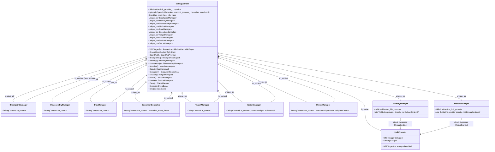

# Class relationships

## Domain side: DebugContext and its 10 components



(`TraceManager` isn't drawn with a peer-access arrow: it's constructed via
its own `TraceManager::Create(DebugContext&)` factory rather than the
uniform `make_unique<X>(*this)` pattern, since it can fail to construct -
see `04-event-dataflow.md` for its worker thread.)

8 of 10 components hold `DebugContext&` and reach every peer only via
`m_context.<Peer>()`. `MemoryManager` and `ModuleManager` still break this
pattern - they hold `providers::LldbProvider&` directly, wired at
construction (`debug_context.cc`: `std::make_unique<MemoryManager>(lldb_provider_)`
vs `std::make_unique<BreakpointManager>(*this)` for the rest). This is a
real, current inconsistency (they can never see a sibling manager even if a
future feature needed them to), not a stale claim - see
`05-known-characteristics.md`.

## The locking model: `WithTarget`, not per-method copy-paste

Every LLDB SB API call anywhere in `core` goes through
`LldbProvider::WithTarget(callable)` (`lldb_provider.hpp`):

```cpp
template <typename Fn>
auto WithTarget(Fn &&fn) -> std::invoke_result_t<Fn> {
    lldb::SBMutex lock = target.GetAPIMutex();
    std::lock_guard<lldb::SBMutex> guard(lock);
    return fn();
}
```

There is no caller-visible lock object to forget, misplace, or hold across a
nested call - the mutex is recursive, so a `WithTarget` call from inside
another `WithTarget` callable is safe by construction, not by convention.
`GetAPIMutex()` itself is no longer part of `DebugContext`'s or
`LldbProvider`'s public surface; the two remaining raw call sites
(`lldb_provider.hpp` itself, and one free function in
`execution_controller.cc` that's always invoked from inside an existing
`WithTarget` scope) are the encapsulation boundary, not exceptions to it.

## Communication side: handler base classes

```mermaid
classDiagram
    class IRequestHandler {
        <<interface>>
        +Run(Request) void
        +GetSupportedFeatures() FeatureSet
    }

    class BaseRequestHandler {
        -Orchestrator& orchestrator_
        -DebugContext& context_
        +Run(Request) void
        +operator()(Request)* void
    }

    class RequestHandler~Args,Resp~ {
        +operator()(Request) void
        #Run(Args)* Resp
        #PostRun() void
    }

    class DelayedResponseRequestHandler~Args,Resp~ {
        +operator()(Request) void
        #Run(Args)* Resp
    }

    IRequestHandler <|.. BaseRequestHandler
    BaseRequestHandler <|-- RequestHandler
    BaseRequestHandler <|-- DelayedResponseRequestHandler
    RequestHandler <|-- "~46 concrete handlers"
    DelayedResponseRequestHandler <|-- LaunchRequestHandler
    DelayedResponseRequestHandler <|-- AttachRequestHandler
```

`IRequestHandler` is the seam `Orchestrator` dispatches through by command
name. `BaseRequestHandler` holds exactly two references - `Orchestrator&`
for communication, `DebugContext&` for domain - and declares `operator()`
pure virtual. `RequestHandler<Args,Resp>` parses args, calls virtual
`Run(const Args&)`, formats the response; `Resp` is either `llvm::Error` or
`llvm::Expected<SomeResponseBody>`, branched at compile time.
`DelayedResponseRequestHandler<Args,Resp>` is the same shape but stashes the
response via `Orchestrator::SetDeferredConfigurationResponse` instead of
sending immediately - used only by `launch`/`attach`, flushed by
`ConfigurationDoneRequestHandler::PostRun`.

`dap/service.hpp` still declares a `Service` class - a second, coarser
dispatch abstraction that used to have a fallback path in
`Orchestrator::HandleRequest`. That fallback (`command_owners_`,
`RegisterService`) has since been removed from `orchestrator.{hpp,cc}`
entirely; `Service` is now an unused class with one unused `#include`
pointing at it, not a live parallel dispatch path. Harmless, and small
enough that it's noted rather than tracked as a finding - see
`05-known-characteristics.md`.
