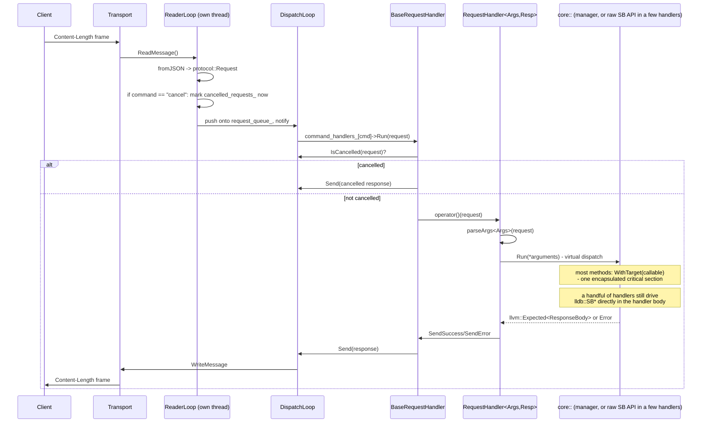
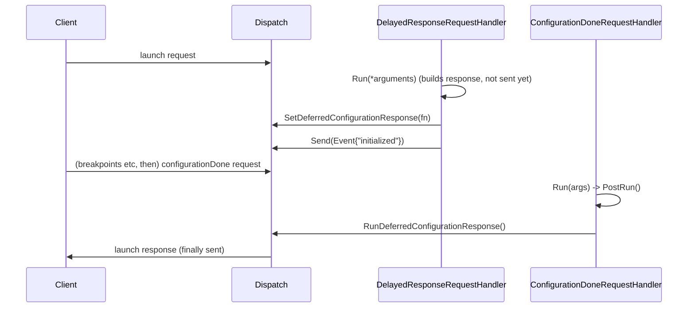

# Request sequence

Dispatch is a reader thread and a dispatch thread, not one thread reading
and handling in lockstep. `Orchestrator::Run()` starts `ReaderLoop` on its
own thread and runs `DispatchLoop` on the caller's:

- **`ReaderLoop`**: blocks on `Transport::ReadMessage()`, decodes each frame
  into a `protocol::Request`, and pushes it onto a queue. A `cancel` request
  is handled specially here, before it's even enqueued: its target request
  ID is inserted into `cancelled_requests_` immediately, so a request still
  sitting in the queue (or already dispatched) can observe cancellation
  without waiting for the `cancel` message itself to reach the front of the
  queue.
- **`DispatchLoop`**: pops one request at a time and calls `HandleRequest`,
  which looks it up in `command_handlers_` and calls `Run`. Still exactly
  one dispatch thread - handler bodies never run concurrently with each
  other - but reading and dispatching are no longer serialized against each
  other the way they used to be.

## Deferred response: launch/attach

`launch` and `attach` use `DelayedResponseRequestHandler` instead of
`RequestHandler`, since the DAP spec expects `initialized` (and the
client's follow-up breakpoint/configuration requests) to happen *between*
the request and its response:

`launch` additionally embeds OpenOCD in-process at this point
(`DebugContext::CreateOpenOcd`, called from `TargetManager::Launch`) - this
is what backs memory/peripheral watches and instruction-trace capture for
the rest of the session. `attach` never creates one; features that need
`context.OpenOcd()` are unavailable under `attach`.

## The locking picture on this path

`BaseRequestHandler::Run` takes no lock itself - every `core` method a
handler calls is expected to lock for its own duration via
`LldbProvider::WithTarget`, not the caller. This holds cleanly for the
methods that actually route through `WithTarget` (most of `core`'s manager
methods, `~15` source files at last count).

It does **not** hold for two specific accessors and the handlers that use
them: `DebugContext::GetLLDBThread`/`GetLLDBFrame` call
`SBProcess`/`SBThread` methods directly, with no `WithTarget` wrapper - and
several handlers (`variables`, `evaluate`, `scopes`, `stackTrace`,
`threads`, most of `symbols/*`) call one of those two accessors and then
keep driving the returned `SBThread`/`SBFrame` themselves. This is the one
real carryover from the pre-`WithTarget` locking review: the redesign made
locking for participating code encapsulated and impossible to get wrong,
but it didn't close this specific pre-existing gap, because closing it
means moving the SB traversal those handlers do out of the handler and into
a `core` method in the first place - a larger change than the locking
redesign itself. See `05-known-characteristics.md`.
