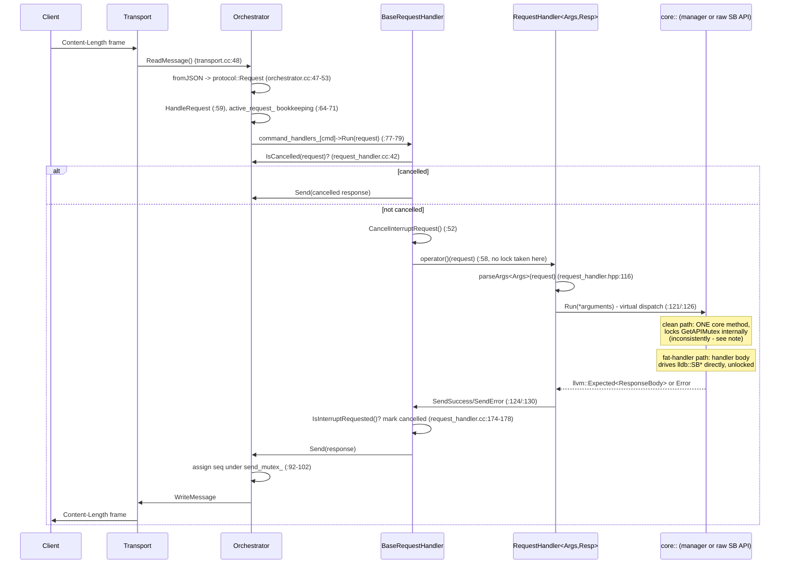
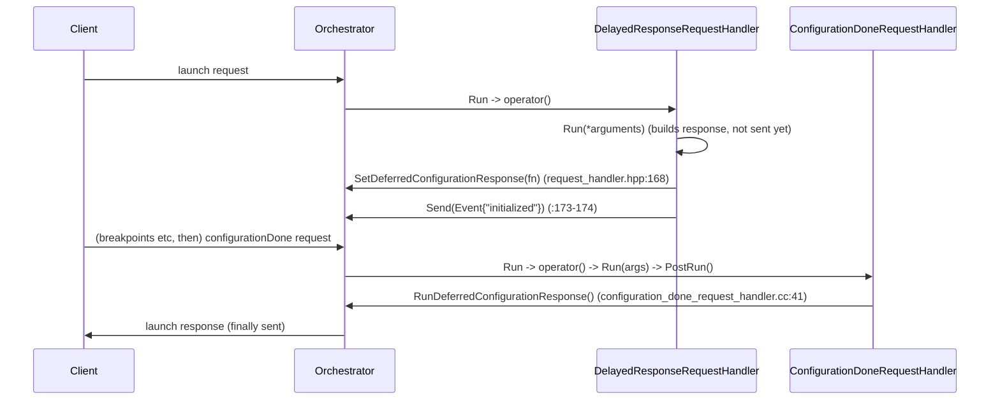

# Request sequence

One request, wire to wire. Dispatch is single-threaded: `Orchestrator::Run`
reads one frame, fully handles it (response included), then reads the next
(`orchestrator.cc:40-57`). The API mutex is never taken on this path itself -
only inside individual `core` methods, inconsistently (see note below and
`05-limitations.md` #1).

## Deferred response: launch/attach

`launch` and `attach` use `DelayedResponseRequestHandler` instead of
`RequestHandler`:

## The API-mutex gap on this path

`BaseRequestHandler::Run`'s own comment states the contract:
"No API-mutex lock here: every core method a handler calls below (via
`operator()`) locks internally for its own duration"
(`request_handler.cc:54-57`). This holds for most `core` managers (the
`GetAPIMutex`/`lock_guard` idiom repeated per method, `05-limitations.md`
#4), but is violated in two independent ways:

1. Fat handlers (`variables`, `evaluate`, `scopes`, `stackTrace`, `threads`,
   most `symbols/*`) skip `core` methods for their SB traversal and touch
   `lldb::SB*` directly in the handler body - no lock exists at any level for
   that code. Example: `scopes_request_handler.cc:18`
   `lldb::SBFrame frame = context_.GetLLDBFrame(args.frameId);` - unlocked
   both in `GetLLDBFrame` (`debug_context.cc:52-58`, no lock) and in the
   handler using the returned frame.
2. Even a "clean delegator" can reach an unlocked `core` method:
   `MemoryManager`/`ProcessMemoryStrategy::Read`/`Write`
   (`memory_manager.cc:13-70`) never take `GetAPIMutex` at all, and
   `read_memory_request_handler.cc:24`
   (`lldb::SBProcess process = context_.Target().GetProcess();`) reads the
   target directly in the handler, also unlocked. "Delegates to one core
   method" is not, on its own, evidence of safety - see
   `05-limitations.md` #1.
