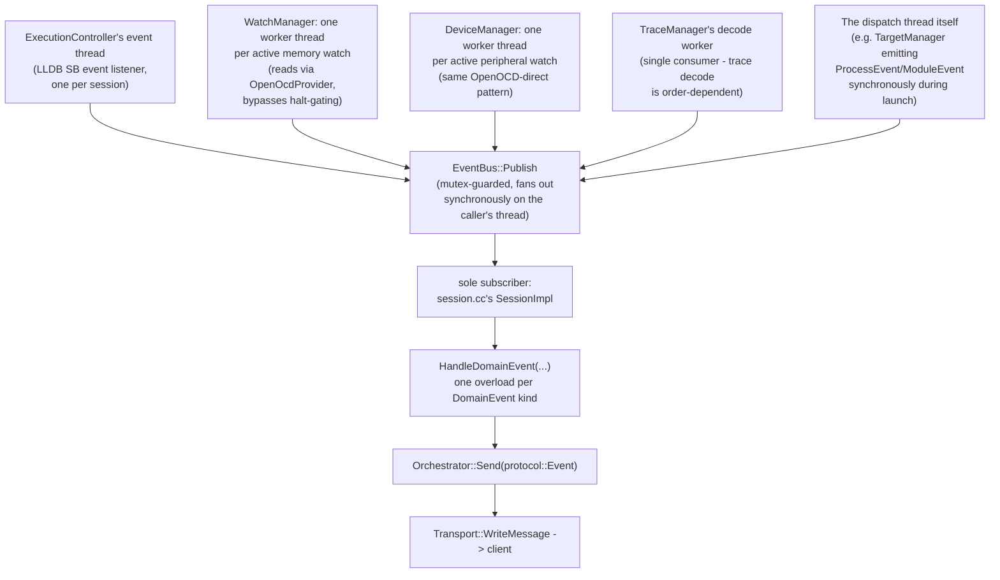

# Event dataflow

Five kinds of thread can push a `DomainEvent` today, not just the LLDB event
thread the previous version of this document described. `EventBus` is the
one place they all converge:



`EventBus::Publish` takes a mutex and calls every subscriber synchronously,
on whichever thread called `Publish` - there's no queue, no dedicated
publish thread. A subscriber must not call back into `Publish`/`Subscribe`.
There's exactly one long-lived subscriber (`session.cc`), so this is safe in
practice; `Subscribe` has no matching `Unsubscribe`, meaning the subscriber
list can only grow (harmless today, worth knowing before adding a second
subscriber).

## DomainEvent: 19 alternatives, plain data only

```
OutputEvent, StoppedEvent, ContinuedEvent, ExitedEvent, ThreadExitedEvent,
ProcessEvent, CapabilitiesEvent, InvalidatedEvent, MemoryEvent, ModuleEvent,
BreakpointEvent, TerminatedEvent, TraceDataEvent, ResetEvent,
TraceStatusEvent, WatchDataEvent, WatchStateEvent, PeripheralWatchDataEvent,
PeripheralWatchStateEvent
```

(`core/include/core/event_bus.hpp`.) Each wraps an already-typed
`dap::protocol::*EventBody`, or is trivially plain data (`OutputEvent`:
category + string; `TerminatedEvent`: a string). This holds the "core never
touches JSON" rule from `00-overview.md` with no exceptions found.

The last seven alternatives - everything from `TraceDataEvent` onward - are
new since the last pass over this document: they're what `TraceManager`,
`WatchManager`, and `DeviceManager` push from their own worker threads.

## Watch and peripheral-watch events: an epoch, not just data

`WatchDataEvent`/`PeripheralWatchDataEvent` don't just carry the polled
bytes - they carry a monotonic `sequence` and an `epoch` that bumps whenever
a write lands on the address/peripheral being watched, incremented *after*
the write physically completes. The watch worker captures the epoch before
its own read and discards the frame at emit time if the epoch moved during
that read - a write racing a poll never produces a frame that looks newer
than it is. Client code (the VS Code extension) renders whatever arrives
with no filtering logic of its own; the guarantee is enforced entirely on
the emitting side.

## Two wire-format quirks

**`TerminatedEvent` string round-trip.** `TargetManager` serializes LLDB's
`SBStructuredData` into a JSON string at emit time, because there is no
fixed protocol struct for an arbitrary structured-data blob. The event
translator in `session.cc` re-parses that string back into
`llvm::json::Value` when building the wire event (wrapped under
`"$__lldb_statistics"`). A parse failure is logged and silently dropped -
the `terminated` event still goes out, just without the statistics body.

**`OutputEvent` per-line re-split.** One `OutputEvent` (an arbitrary
multi-line string) becomes one wire `output` event per line, split on `\n`
in `session.cc`, rather than one event carrying the whole string.

## Threading takeaway

The LLDB event thread (`ExecutionController::EventThreadMain`, started once
per session, joined on teardown) and the request-dispatch thread can be
concurrently inside LLDB SB API today, in the specific gap
`03-request-sequence.md` describes (`GetLLDBThread`/`GetLLDBFrame` and the
handlers built on them bypass `WithTarget`). Everywhere else that touches
shared `SBTarget`/`SBProcess` state from the event thread - e.g. module-load
event handling - goes through `WithTarget` the same as request-dispatch
code does, which is what makes that specific gap the exception rather than
the rule it used to be.

The watch/peripheral-watch/trace worker threads are a structurally
different case: they read through `OpenOcdProvider` directly, not through
LLDB at all, specifically so they keep working regardless of whether the
target is halted (LLDB access requires a stopped process; OpenOCD's GDB
Remote path doesn't). They never touch an `SBTarget`/`SBProcess`/`SBThread`
object, so they aren't part of the LLDB-locking picture at all - the only
thing they share with the rest of the system is `EventBus::Publish`'s
mutex.
