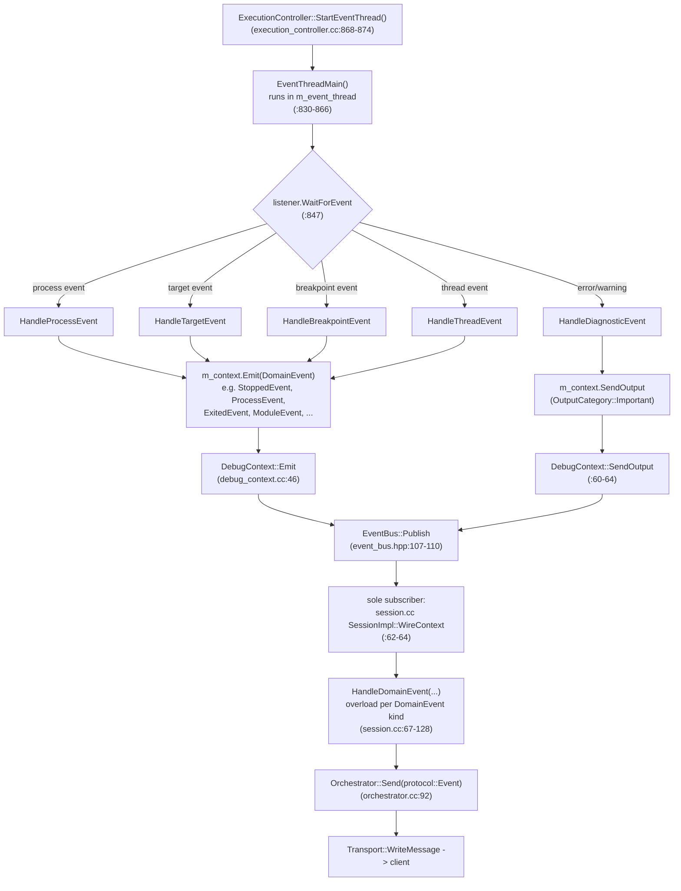

# Event dataflow

A second thread, independent of request dispatch: the LLDB event thread. This
is what makes unlocked SB access from request handlers (`03-request-sequence.md`,
last section) an actual data race, not just a style issue - both threads can
touch the same `SBTarget`/`SBProcess`/`SBThread` state concurrently.



## DomainEvent: 12 alternatives, plain data only

`event_bus.hpp:94-96`:

```
OutputEvent, StoppedEvent, ContinuedEvent, ExitedEvent, ThreadExitedEvent,
ProcessEvent, CapabilitiesEvent, InvalidatedEvent, MemoryEvent, ModuleEvent,
BreakpointEvent, TerminatedEvent
```

Each wraps an already-typed `dap::protocol::*EventBody` (plain data, no JSON
inside `core`) except `OutputEvent` (category + string) and `TerminatedEvent`
(a string). This holds the "core never touches JSON" rule from
`00-overview.md` - confirmed no violation.

`EventBus` (`event_bus.hpp:98-114`) is push-only: `Subscribe` appends to a
vector, `Publish` fans out synchronously to every subscriber on the
publishing thread (i.e. on the event thread, for LLDB-originated events).
There is no `Unsubscribe` - fine today since there is exactly one long-lived
subscriber (`:102-104` comment acknowledges this explicitly), but it means
the subscriber list can only grow.

## Two wire-format quirks

**`TerminatedEvent` string round-trip.** `TargetManager` serializes LLDB's
`SBStructuredData` into a JSON string at emit time
(`target_manager.cc:505`, `BuildTerminatedStatisticsJSON`) because there is
no fixed protocol struct for an arbitrary structured-data blob
(`event_bus.hpp:83-89` comment). The event translator re-parses that string
back into `llvm::json::Value` when building the wire event
(`session.cc:117-127`, wrapped under `"$__lldb_statistics"`). A parse failure
is logged and silently dropped - the `terminated` event is still sent, just
without the statistics body (`session.cc:122-125`).

**`OutputEvent` per-line re-split.** One `OutputEvent` (an arbitrary
multi-line string) becomes one wire `output` event per line, split on `\n`
in a hand-rolled loop (`session.cc:82-93`) rather than one event carrying the
whole string.

## Threading takeaway

`ExecutionController::EventThreadMain` (`execution_controller.cc:830-866`)
runs for the lifetime of a debug session, started once
(`StartEventThread`, `:868-874`) and joined on `StopEventHandlers`
(`:876-881`). Every `HandleProcessEvent`/`HandleTargetEvent`/etc. reads LLDB
event data and, in several cases, target/thread state, while the request
thread may simultaneously be inside an unlocked fat handler
(`03-request-sequence.md`). `lldb_provider.hpp:32-34`'s own comment names
exactly this pair of threads as the reason `GetAPIMutex` exists: "Serializes
access to the debugger/target across threads (the DAP request-handling
thread and the event thread)." See `05-limitations.md` #1.
