# Architecture and Design

## 1. Global Architecture

The engine is organized as a three-layer architecture. Each layer has a single directional dependency: outer layers depend on inner layers, never the reverse.

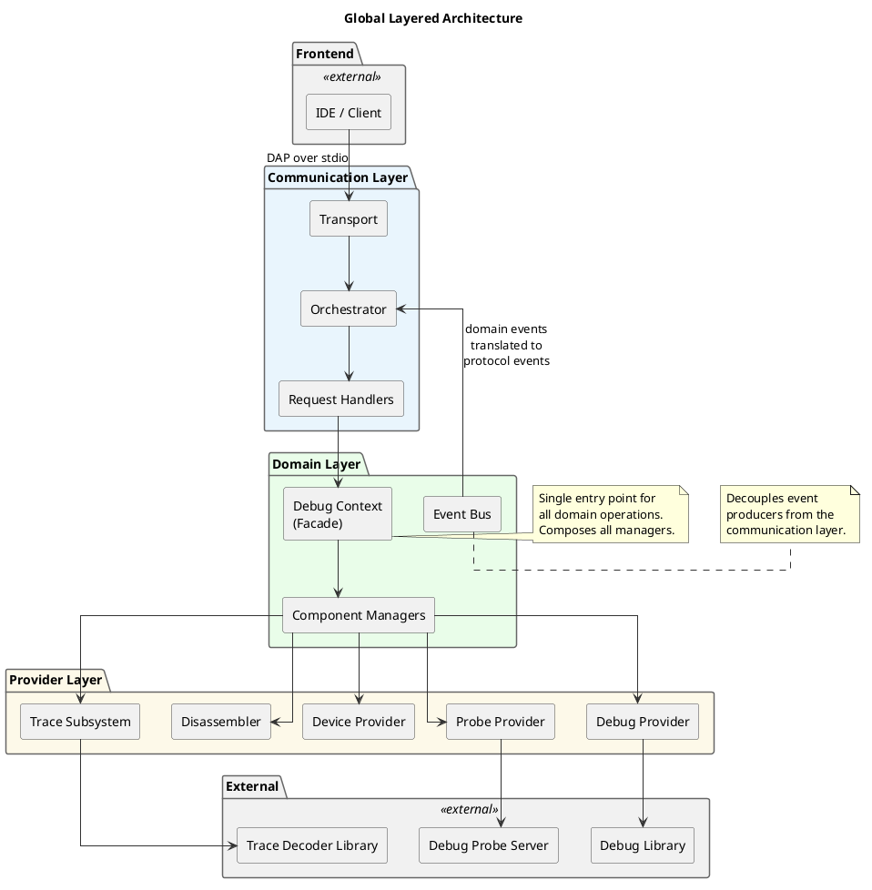

### 1.1 Communication Layer

The communication layer implements the Debug Adapter Protocol. It owns the transport (protocol framing over byte streams), the orchestrator (message decoding, routing, and sequencing), and the request handlers (argument parsing, response formatting). This layer contains no domain logic. Its sole purpose is to translate between the wire protocol and typed domain operations.

### 1.2 Domain Layer

The domain layer contains the debugging engine's core logic. A central facade object composes all domain subsystems: breakpoint management, execution control, memory access, data inspection, device modeling, disassembly, trace analysis, and live monitoring. Each subsystem is encapsulated in a dedicated component manager with a single responsibility. An event bus allows subsystems to emit domain events without coupling to the communication layer.

### 1.3 Provider Layer

The provider layer encapsulates ownership of external resources. Each provider wraps a third-party dependency behind a stable, engine-defined interface. Provider interfaces expose only the engine's own types. No type from an external library appears in a provider's public interface.

The provider layer is itself modular. Individual providers are compiled as independent build targets with isolated dependencies. No provider depends on another provider.

---

## 2. Module Decomposition

The engine is decomposed into modules, each compiled as a separate build target. Module boundaries are enforced at the build system level through explicit link dependencies. A module's public headers constitute its stable interface; internal headers are not visible to dependents.

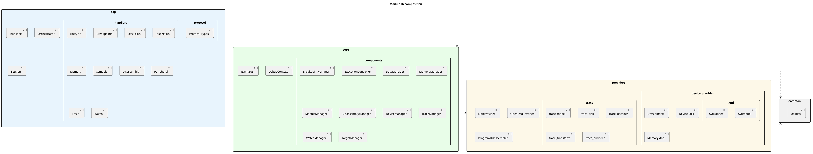

The following table summarizes each module's responsibility.

| Module | Responsibility |
|---|---|
| **dap** | Protocol types, transport, orchestrator, request handlers, session |
| **core** | Domain logic, component managers, event bus, debug context |
| **providers/lldb_provider** | Debug library resource wrapper |
| **providers/openocd_provider** | Debug probe resource wrapper, command queue, thread confinement |
| **providers/device_provider** | Device index, memory map, SVD peripheral model parsing |
| **providers/disassembler** | Firmware image loading, instruction-level precomputation |
| **providers/trace/trace_model** | Value types shared across the trace pipeline |
| **providers/trace/trace_sink** | Trace decoder output adapter producing typed records |
| **providers/trace/trace_decoder** | Trace protocol decoder management |
| **providers/trace/trace_transform** | Typed projections from trace records to domain model types |
| **providers/trace/trace_provider** | Public trace session interface, pipeline composition |
| **common** | Shared utilities (output redirection, client launching) |

---

## 3. Structural Patterns

### 3.1 Facade

The DebugContext class acts as a facade over all component managers. It provides a single entry point through which the communication layer accesses all domain operations. Callers navigate to a specific subsystem through a named accessor rather than managing individual manager lifetimes or dependencies.

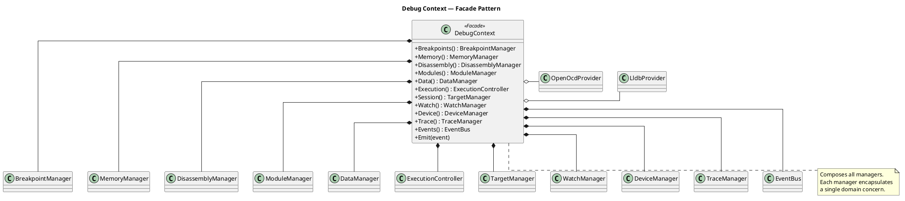

Each component manager is allocated behind an opaque pointer and forward-declared in the facade's header. This decouples the facade's interface from the managers' definitions, reducing compile-time coupling across the codebase.

### 3.2 Strategy

The memory manager uses the Strategy pattern for memory access. It holds a reference to an abstract memory access strategy interface with read and write operations. Two concrete strategies exist: one that routes through the debug library's process abstraction, and one that routes through the debug probe directly.

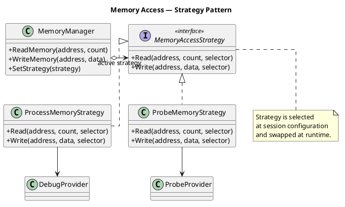

The active strategy is selected during session configuration and can be swapped at runtime. Callers of the memory manager are unaware of which access path is active.

### 3.3 Template Method

The request handler framework uses the Template Method pattern. A generic base class defines the invariant processing sequence: parse the incoming request's arguments into a typed structure, invoke the subclass-defined processing method, format and send the response, and invoke an optional post-processing hook.

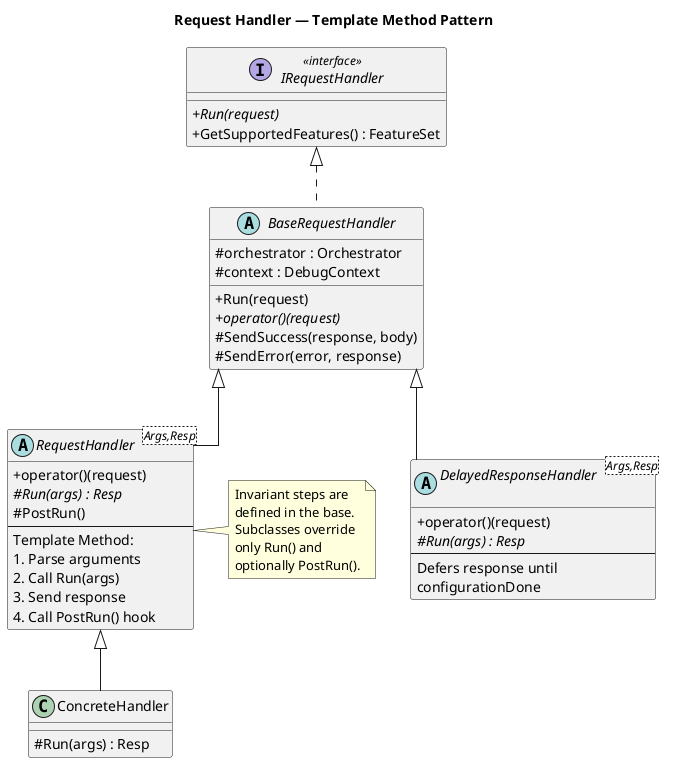

Concrete handlers override only the processing method and optionally the post-processing hook. Argument parsing, error handling, and response transmission are handled entirely by the base class. This eliminates boilerplate across all handlers.

A variant of this base class, the delayed-response handler, overrides the response transmission step to defer sending the response until a later protocol event arrives. This models the protocol's two-phase session initialization sequence.

### 3.4 Type Hierarchy

The breakpoint subsystem uses a class hierarchy to model the different breakpoint variants. An abstract base class defines the common interface for condition evaluation, hit-condition evaluation, and protocol serialization. A middle class adds debug-library-specific state. Leaf classes specialize the creation logic for source breakpoints, function breakpoints, instruction breakpoints, and watchpoints.

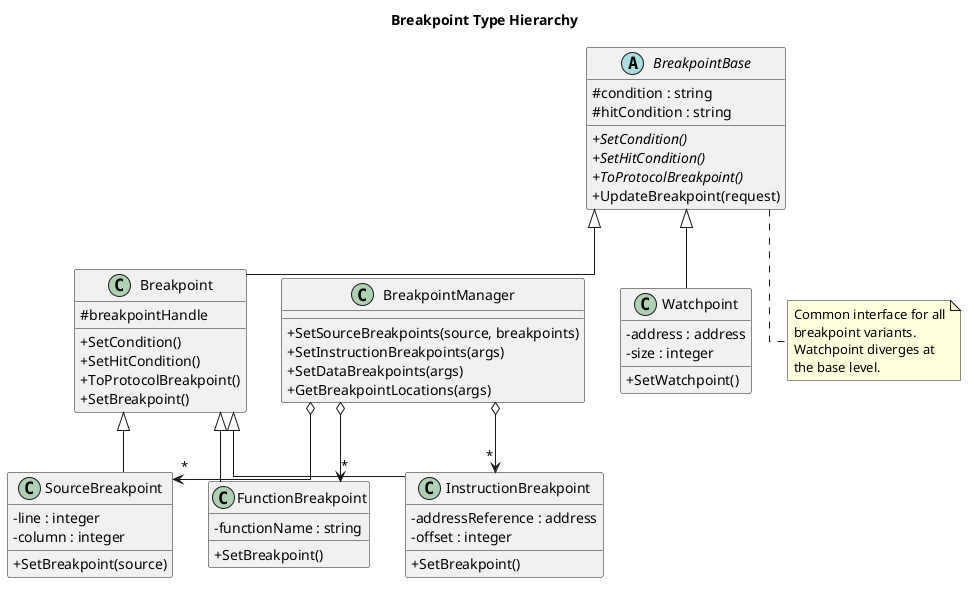

A dedicated breakpoint manager maintains the collections for each variant and provides the set-based reconciliation operations the protocol requires.

### 3.5 Opaque Pointer

Several provider classes use the opaque pointer (Pimpl) idiom to hide implementation details from their public headers. The debug probe provider hides its command queue and the probe server's types. The disassembler hides all parsing library types. The trace session hides the decoder library's state.

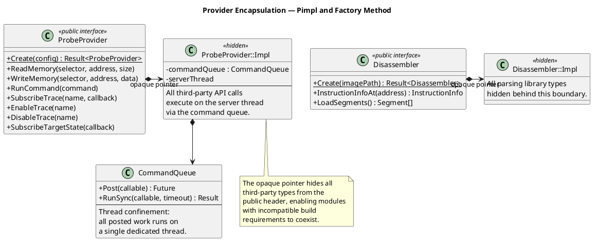

In the disassembler's case, the opaque pointer boundary serves a secondary purpose. The disassembler module and the trace decoder module depend on libraries with incompatible build requirements. The opaque pointer ensures no type from one library appears in a header that the other library's translation units include.

### 3.6 Factory Method

Resource-owning types use static factory methods that return a result-or-error value. The factory method encapsulates multi-step initialization that can fail at any point. If any step fails, the error is returned without leaving a partially-constructed object. Move semantics transfer ownership of the fully-constructed object to the caller.

### 3.7 Customization Point

The trace transform layer uses a compile-time customization point pattern. A primary interface is declared but intentionally left without a default implementation. Each desired output type provides a specialization that implements the transformation from trace records to that output type.

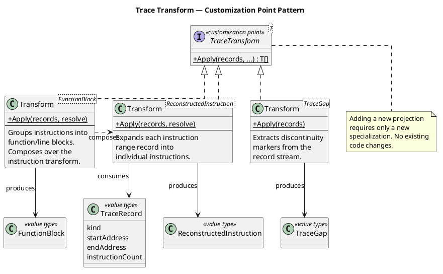

A constrained entry-point function dispatches to the matching specialization. Attempting to use an output type with no specialization produces a compile-time error at the call site. Three specializations exist: one that expands instruction ranges into individual instructions, one that groups instructions into function and line blocks, and one that extracts discontinuity markers. The function-block specialization composes over the instruction specialization rather than re-walking the raw record stream, demonstrating that the mechanism supports composition.

---

## 4. Behavioral Patterns

### 4.1 Command Routing with Handler Registration

The orchestrator uses a command-routing pattern for request dispatch. Each protocol command is handled by a dedicated handler object that implements a common handler interface. Handlers register themselves with the orchestrator by command name during session construction. The orchestrator's dispatch loop looks up the handler for each incoming request and delegates to it.

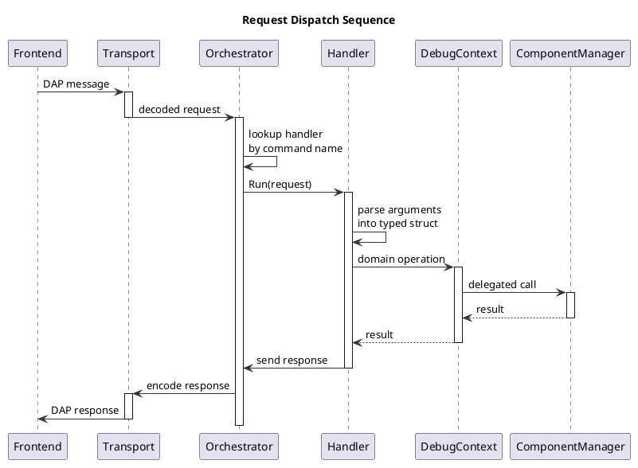

Adding a new command requires only implementing a new handler and registering it. No conditional chain or routing table in the orchestrator needs modification.

### 4.2 Publish-Subscribe with Domain Event Translation

The event bus implements a publish-subscribe mechanism for domain events. Component managers publish typed domain events into the bus without knowledge of who consumes them. The event bus dispatches each event to all registered subscribers.

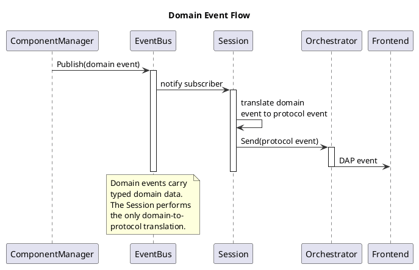

The session object subscribes to the event bus and performs the single domain-to-protocol translation in the system. Each domain event is mapped to the corresponding protocol event and sent through the orchestrator to the frontend. Events that carry domain model types (such as trace data) are enriched with source-frame information at translation time by consulting the disassembler's precomputed data.

### 4.3 Capability Negotiation

Each request handler can declare the protocol capabilities it contributes. During the initialization handshake, the orchestrator aggregates all registered handlers' declared capabilities into a single capability response. This distributes capability declaration to the handlers that implement the corresponding functionality, rather than maintaining a centralized capability list that must be updated in lockstep with handler additions.

---

## 5. Pipeline Architecture

### 5.1 Trace Processing Pipeline

The trace subsystem is organized as a linear processing pipeline with a final fan-out stage. Each stage has a typed input and a typed output.

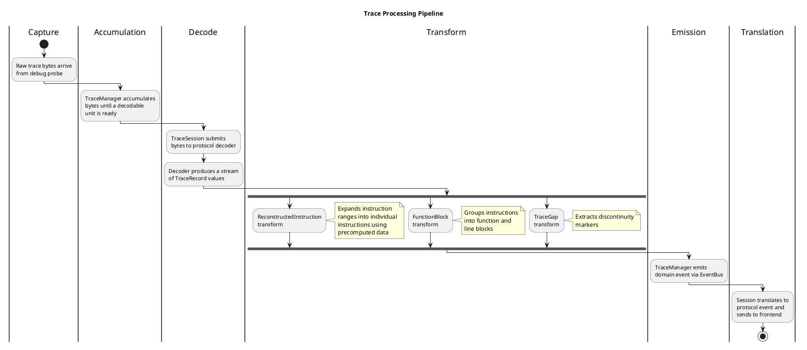

The stages are:

1. **Capture**: Raw trace bytes arrive from the debug probe via a subscription callback.
2. **Accumulation**: The trace manager buffers bytes until a decodable unit is ready and hands them to a dedicated decode worker.
3. **Decode**: The trace session submits bytes to the protocol decoder, producing a stream of typed trace records.
4. **Transform**: The trace records are projected into domain model types through the customization point mechanism. Multiple projections execute in parallel over the same record set.
5. **Emission**: The trace manager emits the transformed results as a domain event through the event bus.

The decode stage is single-consumer. Trace increments are order-dependent, so decode is handled by one dedicated thread rather than a pool. The underlying protocol decoder library never appears in the session's public interface.

### 5.2 Value Types as Pipeline Interfaces

The trace model module defines a set of plain value types that serve as the interface between pipeline stages. These types contain no library-specific dependencies and no virtual methods. The disassembler module produces instruction information values. The trace decoder module produces trace record values. The transform module consumes both without depending on either underlying library. The value-type boundary is what makes this cross-library composition possible.

---

## 6. Concurrency Model

### 6.1 Thread Confinement

The debug probe provider uses a command queue to enforce thread confinement. All operations on the underlying probe API must execute on a single dedicated thread. The command queue accepts arbitrary work items, enqueues them, wakes the dedicated thread, and returns a future for the result.

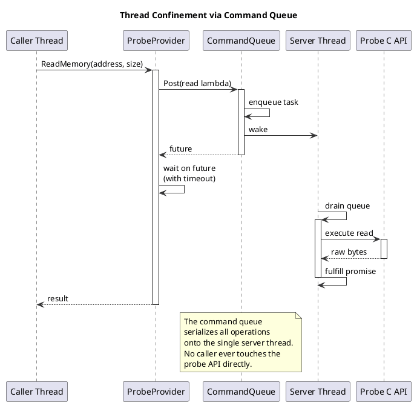

Every public method of the probe provider delegates through the command queue. The provider's public interface is callable from any thread. The queue serializes all actual work onto the single dedicated thread. A synchronous convenience wrapper blocks on the future with a bounded timeout, preventing indefinite waits.

### 6.2 Serialized Access to the Debug Library

The debug library provider exposes a guarded-execution method that serializes all API calls against the execution controller's event thread. Both the dispatch thread (handling requests) and the event thread (processing debug events) access the same underlying objects. The guarded-execution method acquires a recursive lock, allowing nested calls from within the critical section.

### 6.3 Asynchronous Precomputation

The disassembly manager and the device manager use background worker threads to precompute expensive operations. The disassembly manager starts a worker that loads a firmware image and precomputes instruction-level information for the entire binary. The device manager starts a background parse of the device peripheral description file.

Both expose a shared future that callers await only when they actually need the result. Precomputation starts eagerly during session configuration, so by the time the result is needed, the work is already complete or nearly so.

### 6.4 Deterministic Destruction Order

The debug context controls its members' destruction order through declaration order. Members that own threads calling into providers are declared last (destroyed first), ensuring providers remain valid for the lifetime of all threads that use them.

### 6.5 Decoupled Reading and Dispatching

The orchestrator decouples protocol message reading from request dispatching. A reader thread performs blocking reads and enqueues decoded requests into a synchronized queue. The dispatch thread pops and processes one request at a time. This separation allows a cancel request to be enqueued and observed while a long-running request is still in flight on the dispatch thread.
